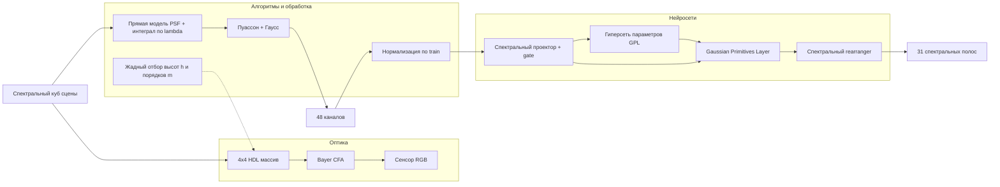

# Архитектура репозитория (IJCAI: Diffract and Conquer)

Документ описывает **логическую** архитектуру, соответствующую разделам статьи, и сопоставление с каталогами `src/diffract_conquer_hsi/`.

## Общий поток

## Слой 1: оптическое кодирование

| Идея из статьи | Файлы / модули |
|----------------|----------------|
| Гармонические дифракционные линзы, три дифракционных порядка, согласование с окнами Bayer | `optical/psf.py`, `configs/default.yaml` (`optical.*`) |
| Формирование изображения \(I_{d,c}\) (уравнение 3) | `optical/forward_model.py` |
| PSF через фазовую пластинку и распространение (4–5) | `optical/psf.py` |
| Покрытие 31 длины волны, задача (8), жадный алгоритм | `optical/lens_selection.py` |

## Слой 2: подготовка данных

| Идея | Файлы |
|------|--------|
| Датасеты NTIRE 2022, ICVL, CAVE, CZ-HSDB | `data/datasets.py` |
| RGB-only baseline vs симуляция «нашей» камеры | `scripts/simulate_forward.py`, `optical/forward_model.py` |
| Нормализация только по train | `data/transforms.py` |

## Слой 3: реконструкция (нейросети)

| Компонент | Назначение | Файлы |
|-----------|------------|--------|
| Спектральный проектор | Локальное окно по спектру, компенсация аберраций, gate \(x + x \cdot \mathrm{conv}^2\) | `models/gaussian_primitives.py` (`SpectralProjectorGate`), `models/ggpir.py` |
| FFN bottleneck | Сжатие в малую размерность перед rearrange (как в Fig. 4) | `models/gaussian_primitives.py` (`SpectralFFN`) |
| Gaussian Primitives | Уравнение (10), комбинация 1D-гауссиан по входным каналам | `models/gaussian_primitives.py` |
| Гиперсеть \(G(\cdot,\theta)\) | В статье — генерация параметров GPL по пикселю; в скелете — задел под пер-канальные генераторы | `models/ggpir.py` (комментарий), будущий модуль `models/hypernet.py` |
| Спектральный rearranger | Восстановление 31 канала, второй gate | `models/ggpir.py` |
| Базeline cmKAN++ | Проектор + rearranger без полной GPL-ветки | `models/cmkan_baseline.py` |

## Слой 4: обучение и оценка

| Задача | Файлы |
|--------|--------|
| Конфигурация эксперимента | `configs/default.yaml`, `processing/config.py` |
| Метрики SAM, PSNR | `processing/metrics.py` |
| Обучение / валидация | `training/train.py`, `training/evaluate.py` |

## Что намеренно не реализовано в скелете

- Полный FFT / angular spectrum для уравнения (5) и калибровка под CMV4000.
- Пиксельные гиперсети и точное воспроизведение cmKANlight (Nikonorov et al., 2025).
- SSIM и загрузка официальных сплитов NTIRE — добавить в `processing/metrics.py` и `data/datasets.py`.

Эти пункты — следующие шаги после фиксации интерфейсов тензоров `[B, C, H, W]` для сырого 48-канального ввода и GT 31-полосного куба.
