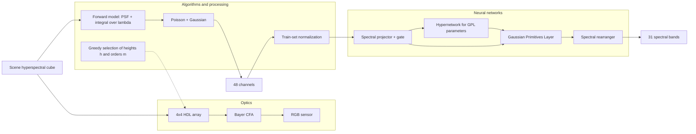

# Repository architecture (IJCAI: Diffract and Conquer)

This document summarizes the **logical** architecture aligned with the paper and maps it to `src/diffract_conquer_hsi/`.

## End-to-end flow

## Layer 1: optical encoding

| Paper idea | Files / modules |
|------------|-----------------|
| Harmonic diffractive lenses, three diffraction orders, alignment with Bayer passbands | `optical/psf.py`, `configs/default.yaml` (`optical.*`) |
| Image formation \(I_{d,c}\) (Eq. 3) | `optical/forward_model.py` |
| PSF via phase plate and propagation (Eqs. 4–5) | `optical/psf.py` |
| Coverage of 31 wavelengths, problem (8), greedy algorithm | `optical/lens_selection.py` |

## Layer 2: data preparation

| Idea | Files |
|------|--------|
| NTIRE 2022, ICVL, CAVE, CZ-HSDB | `data/datasets.py` |
| RGB-only baseline vs simulation of “our” camera | `scripts/simulate_forward.py`, `optical/forward_model.py` |
| Normalization from training split only | `data/transforms.py` |

## Layer 3: reconstruction (neural)

| Component | Role | Files |
|-----------|------|--------|
| Spectral projector | Local spectral window, aberration compensation, gate \(x + x \cdot \mathrm{conv}^2\) | `models/gaussian_primitives.py` (`SpectralProjectorGate`), `models/ggpir.py` |
| FFN bottleneck | Low-dimensional bottleneck before rearrange (Fig. 4) | `models/gaussian_primitives.py` (`SpectralFFN`) |
| Gaussian primitives | Eq. (10): 1D Gaussians over input channels | `models/gaussian_primitives.py` |
| Hypernetwork \(G(\cdot,\theta)\) | Paper: per-pixel GPL parameters; skeleton: hook for per-channel generators | `models/ggpir.py` (comments), future `models/hypernet.py` |
| Spectral rearranger | Restore 31 channels, second gate | `models/ggpir.py` |
| cmKAN++ baseline | Projector + rearranger without full GPL branch | `models/cmkan_baseline.py` |

## Layer 4: training and evaluation

| Task | Files |
|------|--------|
| Experiment configuration | `configs/default.yaml`, `processing/config.py` |
| SAM, PSNR metrics | `processing/metrics.py` |
| Training / validation | `training/train.py`, `training/evaluate.py` |

## Deliberately out of scope in this skeleton

- Full FFT / angular spectrum for Eq. (5) and CMV4000 calibration.
- Pixel-wise hypernetworks and a faithful cmKANlight port (Nikonorov et al., 2025).
- SSIM and official NTIRE splits — add in `processing/metrics.py` and `data/datasets.py`.

Next steps: freeze tensor layouts `[B, C, H, W]` for 48-channel raw input and 31-band ground-truth cubes, then implement the items above.
